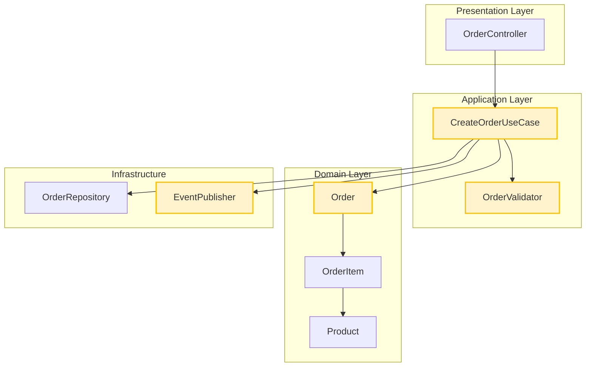
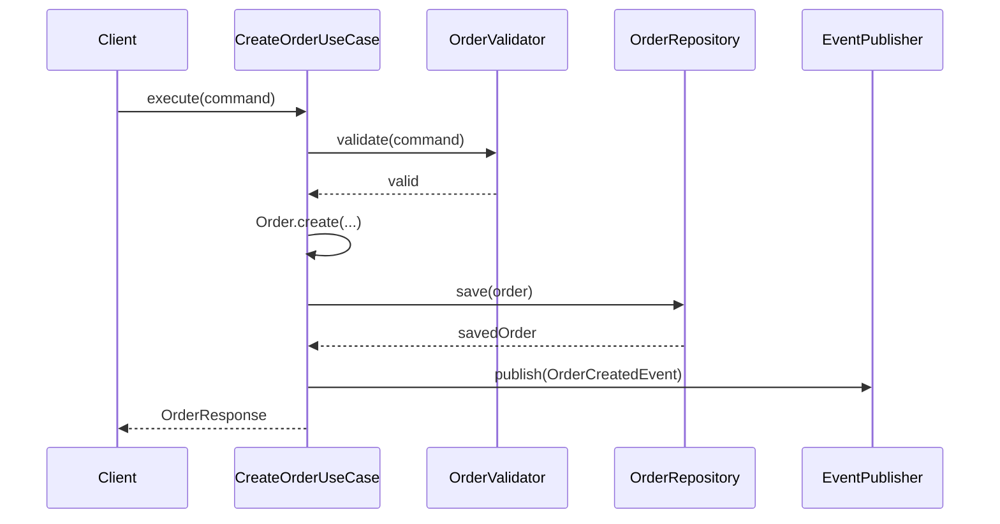
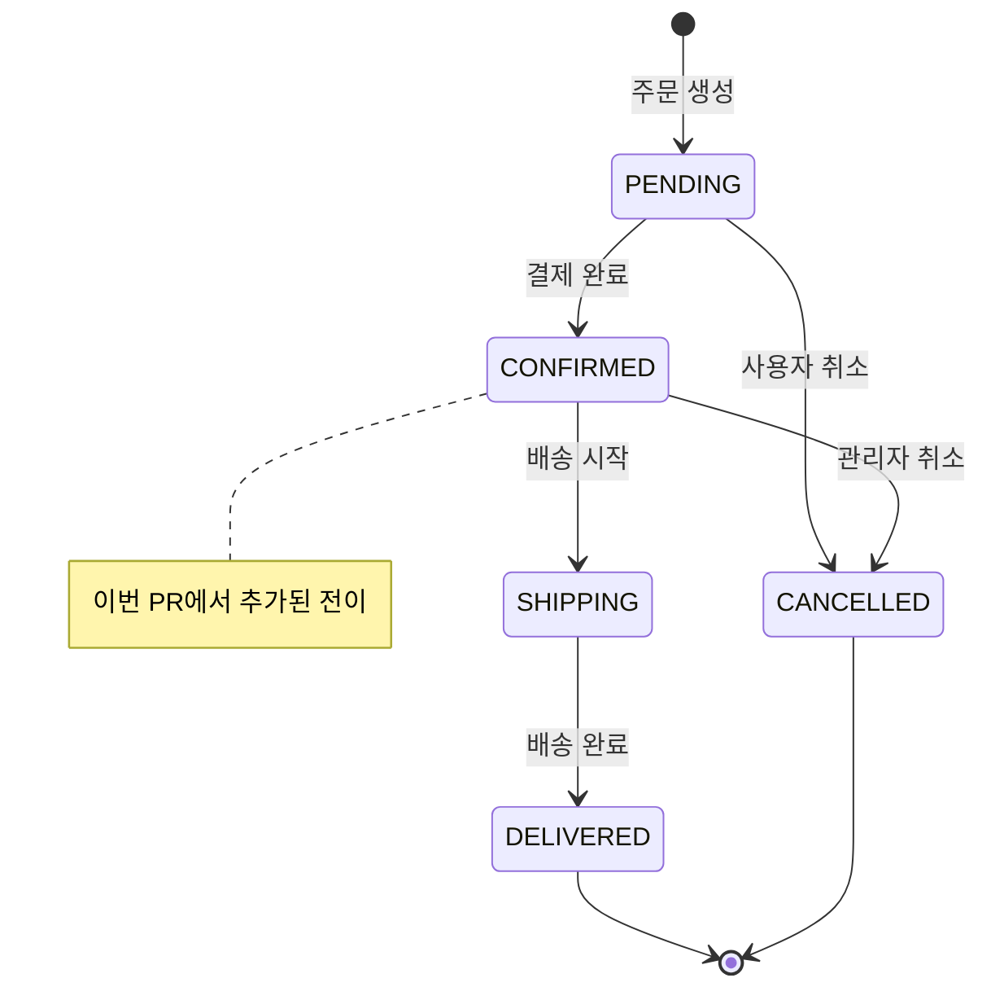

# PR 시각화 가이드

PR에 Mermaid 다이어그램을 포함하여 리뷰어의 이해를 돕는다. GitHub는 Mermaid를 네이티브 렌더링한다.

## 포함 판단 기준

시각화가 리뷰어에게 도움이 되는지를 기준으로 판단한다. 아래는 참고용 — 리뷰어 관점에서 "다이어그램이 있으면 코드를 읽기 전에 맥락을 잡을 수 있겠다"는 확신이 들면 포함한다.

**포함 권장:**
- 새 도메인/모듈 추가
- 기존 흐름 변경 (상태 전이, 이벤트 흐름, API 호출 순서)
- 3개 이상 컴포넌트 간 상호작용 변경
- 아키텍처 레이어 간 의존성 변경

**생략 가능:**
- 단순 필드 추가, 오타 수정, 설정값 변경
- 단일 파일 내 로직 수정으로 외부 영향이 없는 경우

판단이 애매하면 사용자에게 묻는다: `"이번 PR에 시각화를 포함할까요? (Y/n)"`

## 큰 그림 (Architecture Context)

변경이 전체 시스템에서 어디에 해당하는지 보여준다. 리뷰어가 "이 PR이 전체 구조에서 어떤 위치인지" 파악하는 용도.

**생성 규칙:**
1. 이번 PR이 영향을 주는 레이어/모듈을 포함하는 최소 범위의 아키텍처 다이어그램
2. 변경된 부분을 시각적으로 구분 (스타일링으로 하이라이트)
3. 변경되지 않은 주변 컴포넌트도 포함하여 맥락 제공

**예시:**
```markdown
### Architecture Context


```

## 작은 그림 (Detail Flow)

이번 변경의 세부 동작을 보여준다. 리뷰어가 "코드가 어떤 순서로 실행되는지" 이해하는 용도.

**다이어그램 유형 선택:**

| 변경 내용 | 적합한 다이어그램 |
|-----------|-----------------|
| API 호출 흐름, 서비스 간 상호작용 | Sequence Diagram |
| 비즈니스 로직 분기, 조건부 처리 | Flowchart |
| 상태 전이 (주문 상태, 결제 상태 등) | State Diagram |
| 데이터 모델 관계 | ER Diagram |
| 이벤트 기반 처리, 비동기 흐름 | Sequence Diagram + 비동기 표기 |

**다이어그램 분리 기준:**

동기 흐름과 비동기 흐름이 공존하는 경우 (예: 결제 요청 + PG사 콜백), 트리거 주체가 다르면 별도 다이어그램으로 분리한다.

| 조건 | 처리 |
|------|------|
| 트리거 주체가 동일 (Client → 서버 → 응답) | 1개 다이어그램에 통합 |
| 트리거 주체가 다름 (Client 요청 vs PG사 콜백) | 별도 다이어그램으로 분리 |
| 참여자가 5개 이하이고 흐름이 선형적 | 통합 가능 |
| 참여자가 6개 이상이거나 alt/loop 분기가 복잡 | 분리 권장 |

분리 시 각 다이어그램에 명확한 제목 부여 (예: "결제 요청 플로우", "비동기 콜백 처리").

**예시 — Sequence Diagram:**
```markdown
### Detail Flow: 주문 생성 프로세스


```

**예시 — State Diagram:**
```markdown
### Detail Flow: 주문 상태 전이


```

## PR body 삽입 형식

시각화는 PR body의 `## Diagrams` 섹션에 넣는다. 큰 그림을 먼저, 작은 그림을 뒤에 배치한다.

```markdown
## Diagrams

<details>
<summary>Architecture Context — 전체 구조에서 변경 위치</summary>

```mermaid
(큰 그림 다이어그램)
```

</details>

### Detail Flow: {흐름 제목}

```mermaid
(작은 그림 다이어그램)
```
```

**배치 원칙:**
- 큰 그림은 `<details>` 접기로 감싼다 — 이미 아키텍처를 아는 리뷰어는 펼치지 않아도 된다
- 작은 그림은 바로 보이도록 열어둔다 — 이번 변경의 핵심 흐름이므로
- 작은 그림이 2개 이상이면 각각 제목을 달아 구분한다
